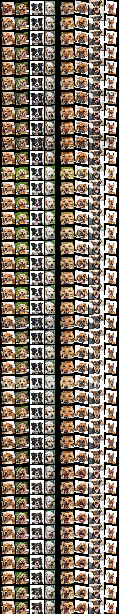
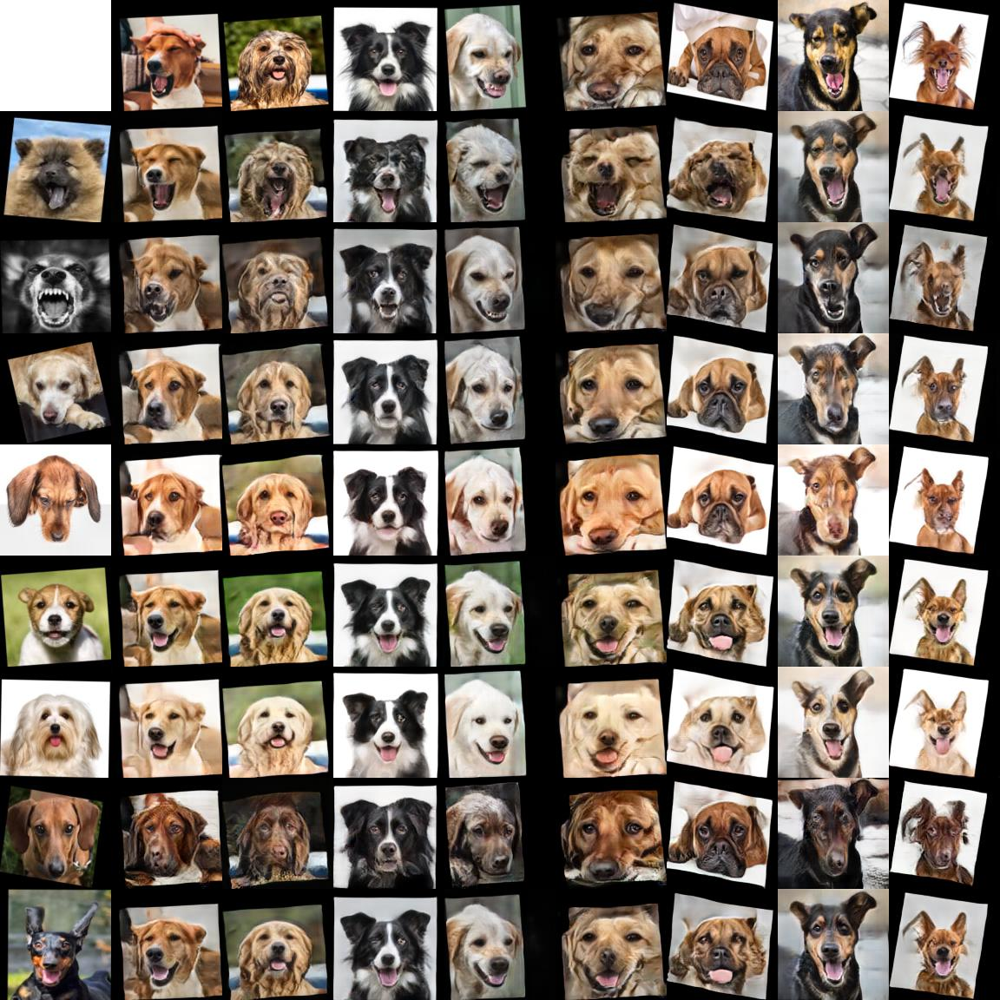

# Synthesis of animal facial expressions using Stargan-v2

This repository is a fork of the official stargan-v2 implementation.

## Modifications

We added a histogram loss to the loss function of the generator.

## References

- Afifi, Mahmoud, et al. HistoGAN: Controlling Colors of GAN-Generated and Real Images via Color Histograms. Proceedings of the IEEE/CVF Conference on Computer Vision and Pattern Recognition, 2020, pp. 7941?7950.
- Choi, Yunjey, et al. StarGAN v2: Diverse Image Synthesis for Multiple Domains. ArXiv Preprint ArXiv:1912.01865, 2019.

